## QUICK LINKS:

#### Detailed Demo video: https://youtu.be/xI3uaBU3FQc
#### Live Link: https://encorefans.vercel.app/
#### Launch video: https://x.com/historiah_hq/status/2078908850711798110?s=20
#### X Devlog: https://x.com/historiah_hq/status/2078905760403050752?s=20

---

# ENCORE

Every World Cup 2026 match, pressed as a record.

ENCORE turns the TxLINE consensus odds feed on Solana into a spoiler-free music catalogue. Each fixture becomes a "track": ninety-plus minutes of betting market movement mastered into a waveform you can scrub, collect, argue over, and cryptographically verify against the roots TxODDS commits on-chain. The sleeve shows the market swing, never the score. The drama stays sealed until you press play.

## How it works

1. **The Feed.** TxLINE publishes consensus odds for the World Cup on Solana devnet. When a visitor connects a wallet, the browser provisions its own session end to end: guest JWT, an on-chain `subscribe` transaction on the free World Cup tier, then a wallet-signed activation that yields an API token. No backend, no shared keys, nothing baked into the app. Sessions are cached per wallet in localStorage.

2. **The Cut.** An offline pipeline (`pipeline/`) enumerates every finished fixture, harvests full historical odds and scores through the 5-minute interval endpoints (`ingest.ts`), then presses each match into a compact track record (`compute.py`): a per-minute volatility waveform, a win-probability timeline, "quakes" (sudden market shocks that mark goals), card events, playlist metrics, and templated commentary lines. Output is a single `data/tracks.json` the app ships with.

3. **The Play.** The player renders the waveform and lets you drop the needle anywhere. Probability, commentary beats, goals, and cards unfold minute by minute as the market lived them.

## Anatomy of a track

Every entry in `data/tracks.json` is a self-contained record of one fixture — 102 of them, covering every finished match from the group stage through the semi-finals. The important fields:

| Field | What it holds |
|---|---|
| `wave` | Per-minute market volatility across 135 minutes — the waveform the player renders |
| `prob` | Win-probability timeline as `[minute, home, draw, away]` rows, sampled from the consensus odds |
| `opening` / `closing` | The market's first and last word on the match |
| `quakes` | Sudden market shocks: any single step that moves a side's win probability by 7+ points (nearby shocks on the same side merge, because odds settle in steps) |
| `goals` | Real goal events where the score feed covers the match; inferred from quakes where it doesn't |
| `cards` | Booking events from the stats feed |
| `metrics` | The five playlist metrics below |
| `lines` | Templated commentary beats, revealed at the minute they occur |

The playlist metrics are the app's whole editorial voice, and each one is a pure function of the odds:

- **volatility** — total per-minute market movement across the match; the loudness of the record
- **lateDrama** — movement from the 70th minute on; how much the ending hurt
- **maxSwing** — the single biggest quake; the hardest moment
- **upset** — the favourite's opening probability, counted only when a 55%+ favourite failed to win
- **flips** — lead changes: how many times the market's most-likely outcome changed

Matches whose score events have aged out of the API's retention window become **bootleg recordings**: no scoreline is fabricated — the market's shockwaves stand in as the only goals, and the sleeve is labelled by market consensus instead of a recorded final score.

## Core features

### Spoiler-free replay player
Scrub any track from kickoff to full time. The UI is built around one rule: nothing reveals the result before playback reaches it. Sleeves, cards, and share images encode volatility and swing, not scores. Matches played before the score feed launched are labelled by market consensus rather than a recorded final score.

### Playlists and the Archive
Tracks are auto-curated into playlists from their metrics: **Bangers** (highest volatility), **Heartbreaks** (late drama), **Daylight Robbery** (upsets), **Mood Swings** (probability flips), and **Lullabies** (the flattest games). The Archive holds the whole vault, searchable and filterable by stage, team, and chaos.

### Team runs
Every nation gets a run page at `/run/[team]`: its full tournament as a poster series with aggregate stats, themed in the team's colours, with a downloadable poster image.

### Compare and BANTER
Put two tracks on the bench at `/compare` and BANTER settles the argument. Verdicts are pure functions of TxLINE-derived metrics, so the same two tracks always produce the same roast, backed by three receipt stats. Every verdict has a shareable card.

### The Booth (live)
A live room streaming odds off the wire over SSE, cut into waveform in real time as they land.

### The Mystery
A daily guess-the-track game at `/guess`. One mystery match a day, picked deterministically so every visitor gets the same puzzle. Wrong guesses reveal clues one at a time, with streaks tracked locally.

### On-chain verification
Proofs are not just fetched, they are executed. The app calls the TxLINE program's `validate_odds` (and `validate_stat` for matches with real score data) as read-only `.view()` simulations against devnet. The program itself recomputes the Merkle branch up to the root TxODDS committed on-chain and returns the verdict. No signature, no fee, and the answer comes from the program, not from us.

### Pressings
Collect a match as a Token-2022 NFT minted by your own wallet on devnet. No Metaplex: metadata lives on the mint account via the MetadataPointer and TokenMetadata extensions. Two fields make each pressing provable:

- `dataHash`: sha256 of the canonical track record rendered in the app
- `oddsRoot`: the Merkle sub-tree root TxODDS committed on-chain for the record's batch

Your shelf of pressings appears on the dashboard, and each has hosted metadata at `/track/[id]/pressing.json`.

### Dashboard and sharing
The dashboard charts your listening history and pressings per wallet. Tracks, comparisons, and team runs all render themed OpenGraph images, and share cards support copy, open, and PNG download.

## Product utility and business model

### The problem it solves

Football is the world's biggest spoiler problem. Hundreds of millions of fans watch matches on delay — time zones, work, life — and one push notification ruins everything. Highlight platforms fight this with blurred thumbnails and "hide scores" toggles that leak constantly, because their underlying asset (video) *is* the spoiler. ENCORE inverts the problem: its underlying asset is the betting market's heartbeat, which encodes all of the drama and none of the result. A track can be browsed, ranked, shared, and argued over in complete safety, then replayed to feel the match unfold.

The second problem is provenance. Digital sports memorabilia has been sold for years with nothing behind it but a JPEG and a promise. A pressing is different in kind: its `dataHash` commits to the exact record you replayed, and its `oddsRoot` chains it to a Merkle root TxODDS committed on-chain before the collectible existed. Anyone can re-run `validate_odds` and get a verdict from the oracle program itself — not from ENCORE.

### Who it's for

- **The delayed viewer** — checks whether last night's match is worth the full replay without learning the score. "Bangers" versus "Lullabies" is the honest answer TV guides can't give.
- **The collector** — mints the matches that mattered to them, provably tied to oracle-committed data rather than to a platform's database.
- **The arguer** — settles "our comeback was better than yours" with BANTER's receipts instead of vibes, and every verdict is a shareable card.
- **The daily player** — the Mystery's one-puzzle-a-day loop, the same match for every visitor, brings people back between matchdays.

### How it makes money

The World Cup archive stays free — it is the top of the funnel. Revenue stacks on top of it:

1. **Premium competitions.** TxLINE's subscription tiers are already on-chain; the free World Cup tier is what the app subscribes to today. Club football is the paid catalogue: domestic leagues, the Champions League, historical seasons — sold per-competition or as an all-access pass, using the same wallet-signed subscribe flow the app already runs end to end.
2. **Pressings as merchandise.** Browsing is free; pressing is the purchase. On mainnet, mints price like posters (single-digit dollars), with limited "first pressing" runs per match and team box sets bundled off the run pages. Because metadata lives on the mint itself, secondary-market royalties are enforceable without a marketplace dependency.
3. **B2B white-label.** The pipeline turns any odds feed into a consumer replay product. Broadcasters and highlight platforms license it as a spoiler-safe front door to their video; sportsbooks license it as a retention surface that plays their own market's story back to bettors after full time. TxODDS itself gains a consumer showcase for feed data that otherwise only quants ever see.
4. **Sponsorship inventory.** Playlists are native premium slots ("Bangers, presented by …"), and every share card, poster, and OG image the app renders is branded surface area that the sharing loop distributes for free.

### The growth loop

Every feature exports an image: track sleeves, BANTER verdict cards, team run posters, Mystery results. Each is spoiler-free by construction, so fans can post them mid-tournament without caveats — the organic sharing that score-based products have to suppress is exactly what ENCORE is built around. Sharing costs the platform nothing (there is no server), and every shared card is an entry point back into the free archive.

## Screenshots

Full-page captures of each section. Click one to expand.

<details>
<summary><b>Landing</b> - every match is a track</summary>
<br>

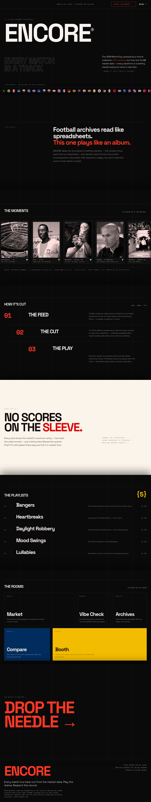

</details>

<details>
<summary><b>Market</b> - every playlist in crates</summary>
<br>

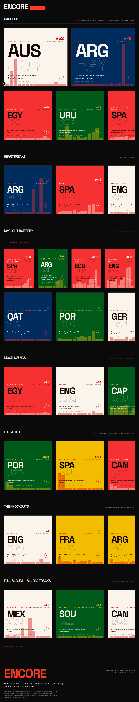

</details>

<details>
<summary><b>Archive</b> - the whole vault, searchable</summary>
<br>

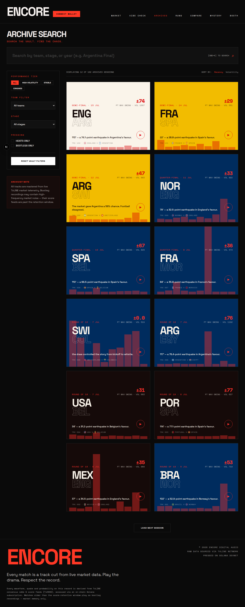

</details>

<details>
<summary><b>Track player</b> - liner notes, metrics, and the authenticity panel</summary>
<br>

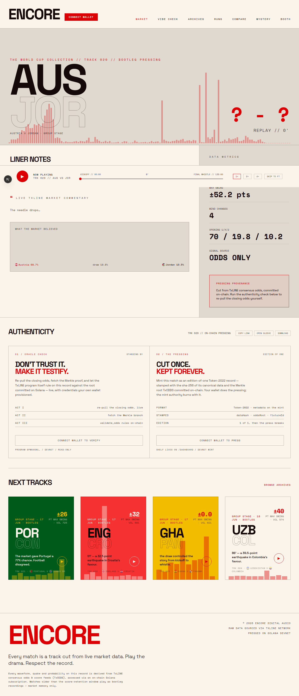

</details>

<details>
<summary><b>Compare</b> - three on the bench, two in the ring</summary>
<br>

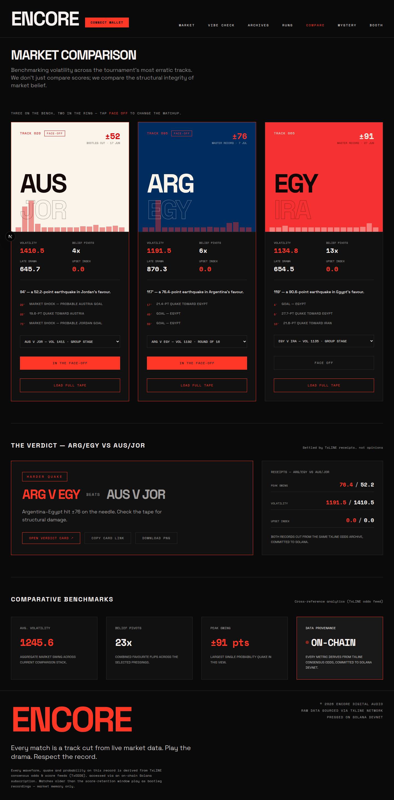

</details>

<details>
<summary><b>The Booth</b> - the live room on standby</summary>
<br>

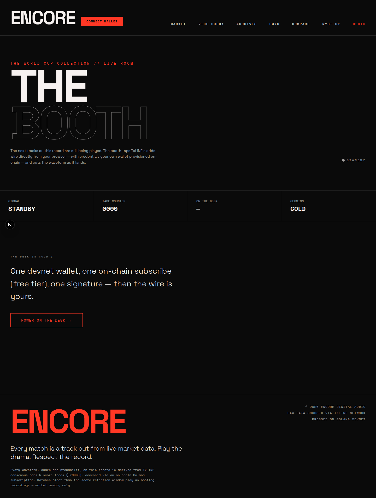

</details>

<details>
<summary><b>The Mystery</b> - one waveform, five guesses</summary>
<br>

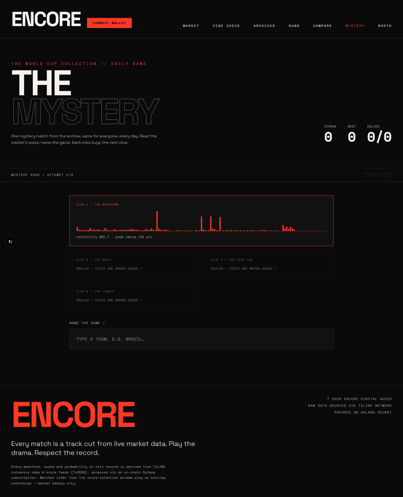

</details>

<details>
<summary><b>Vibe Check</b> - the dashboard</summary>
<br>

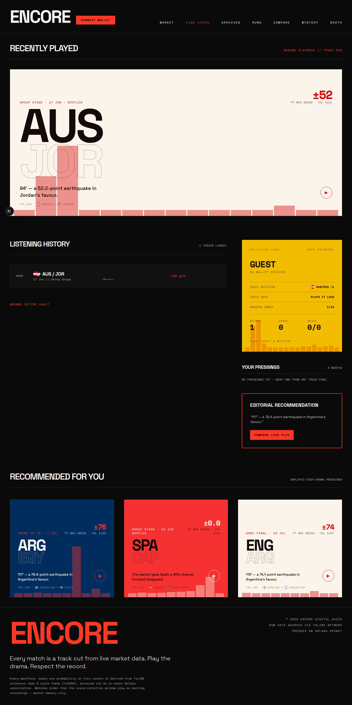

</details>

<details>
<summary><b>Team run</b> - Argentina's tournament as a poster series</summary>
<br>

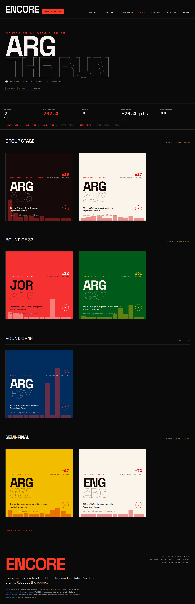

</details>

<details>
<summary><b>Pressing</b> - a minted Token-2022 record on the shelf</summary>
<br>

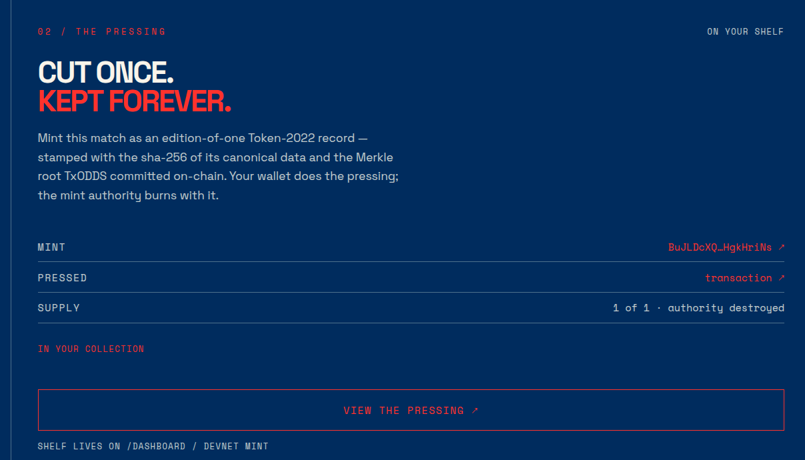

</details>

## Architecture

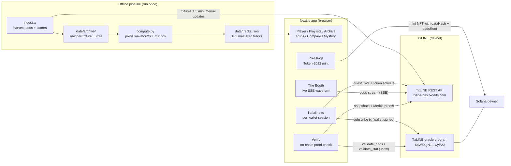

The split is deliberate: the pipeline does the heavy harvesting once and ships a static archive, so browsing is instant and free of API load. Everything trust-sensitive (session auth, proof verification, minting) runs live in the visitor's browser against TxLINE and Solana directly.

## TxLINE API endpoints in use

All calls go to `https://txline-dev.txodds.com`. The app authenticates with a guest JWT upgraded to a wallet-activated API token.

| Endpoint | Used by | Purpose |
|---|---|---|
| `POST /auth/guest/start` | app, pipeline | Bootstrap a guest JWT for a wallet |
| `POST /api/token/activate` | app, pipeline | Wallet-signed activation, returns the API token |
| `GET /api/fixtures/snapshot?competitionId=&startEpochDay=` | Booth, pipeline | Enumerate World Cup fixtures |
| `GET /api/odds/stream?fixtureId=` | Booth | Live consensus odds over SSE |
| `GET /api/odds/snapshot/{fixtureId}?asOf=` | Verify, Pressings | A settled odds row near a chosen minute (probed on an asOf ladder) |
| `GET /api/odds/validation?messageId=&ts=` | Verify, Pressings | Merkle proof and committed odds root for that row |
| `GET /api/scores/snapshot/{fixtureId}?asOf=` | Verify | Final score rows for matches with real score data |
| `GET /api/scores/stat-validation?fixtureId=&seq=&statKey=` | Verify | Merkle proof for goal stats |
| `GET /api/odds/updates/{interval}` | pipeline | Historical odds, harvested in 5 minute intervals |
| `GET /api/scores/updates/{interval}` | pipeline | Historical score events, same interval scheme |

On top of the REST API, the app calls three instructions on the TxLINE oracle program: `subscribe` (wallet-signed, free World Cup tier), and `validate_odds` / `validate_stat` as read-only `.view()` simulations that make the program itself verdict on each proof.

## Stack

- **Frontend:** Next.js 16 (App Router), React 19, Tailwind CSS 4
- **Solana:** `@solana/web3.js`, Anchor, `@solana/spl-token` (Token-2022), wallet-adapter
- **Data:** TxLINE API (`txline-dev.txodds.com`) plus the TxLINE oracle program on devnet (`6pW64gN1s2uqjHkn1unFeEjAwJkPGHoppGvS715wyP2J`)
- **Pipeline:** TypeScript ingest, Python compute; runs offline, outputs static JSON

There is no application server or database. All live data access happens from the visitor's browser against the TxLINE API and Solana devnet.

## Getting started

```bash
npm install
npm run dev
```

Open [http://localhost:3000](http://localhost:3000). Optionally set `NEXT_PUBLIC_RPC_URL` to a custom Solana devnet RPC (defaults to `https://api.devnet.solana.com`). Connect a devnet wallet to activate a TxLINE session, verify proofs, and mint pressings; browsing the archive works without one.

To rebuild the archive from scratch:

```bash
cd pipeline
NETWORK=devnet npx ts-node scripts/ingest.ts   # harvest odds + scores
python3 scripts/compute.py                     # press data/tracks.json
```

## Project structure

```
app/            routes: market, archive, compare, live, guess, dashboard, run, track
components/     player, waveform, match cards, verify, press, share cards
lib/            txline session, track model, banter, mystery game, pressing, on-chain verify
pipeline/       offline ingest (TypeScript) + track compute (Python)
data/           tracks.json, the pressed archive the app ships with
```
